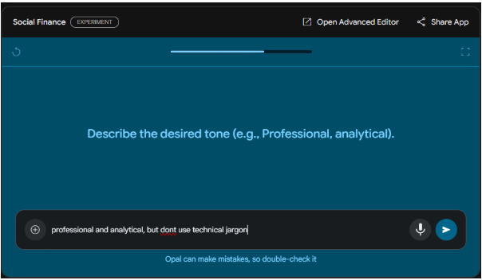
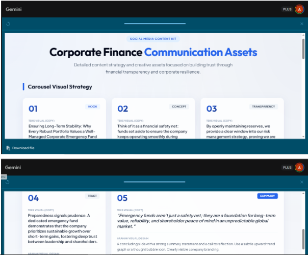

# Social Finance: AI-Powered Content Workflow

**Social Finance** is an automated workflow built on [Gemini Opal](https://opal.google/) designed to streamline the creation of high-quality, corporate finance social media content. It transforms high-level topics into structured carousel outlines and engaging copywriting, significantly reducing production time.

🔗 **[Try the Social Finance: AI-Powered Content Workflow App on Gemini Opal now!](https://opal.google/app/1-ye6Q8wcq0YWAAt_vefPLatuXvpiWGxF)**

---

## Problem Statement
The internal Social Media team faces a bottleneck in maintaining an active presence (minimum 3 posts/week) due to:
* **High Time Cost:** Brainstorming, visual conceptualization, and copywriting are labor-intensive.
* **Consistency Issues:** Maintaining a consistent corporate tone across technical financial topics is difficult.
* **Resource Constraints:** Limited bandwidth to tailor content for specific stakeholders (investors, employees, B2B clients).

## The Solution
A "Human-in-the-Loop" AI workflow that automates the creative heavy lifting. By providing 4 structured inputs, the system generates a complete content strategy ready for design and publishing.

### Workflow Visualization

*Figure 1: The structured input interface ensuring consistent prompting.*

### Key Features
* **Automated Storyboarding:** Generates a 6-slide carousel outline with visual instructions.
* **Tone Calibration:** Adjusts language based on target audience (e.g., "Professional yet accessible" for investors).
* **Strategic Alignment:** Ensures every post aligns with specific business goals like transparency or trust-building.

---

## How It Works

The workflow utilizes Gemini's generative capabilities to process structured inputs into creative assets.

### Input Parameters
| Parameter | Description | Example |
| :--- | :--- | :--- |
| **Topic** | The core financial subject matter | *Importance of Corporate Emergency Funds* |
| **Audience** | Who is this for? | *Investors & Shareholders* |
| **Goal** | What business objective does this serve? | *Build transparency & trust* |
| **Tone** | The desired voice of the content | *Professional, analytical, no jargon* |

### Output Deliverables
1.  **Carousel Visual Strategy (6 Slides):**
    * **Hook:** Catchy opening slide concept.
    * **Content Body:** Educational points broken down (e.g., "Emergency funds as a foundation for value").
    * **CTA:** Strong closing slide.
2.  **Post Caption:** Fully written copywriting including hashtags.

---

## Demo & Case Study

**Scenario:** The finance team needs to communicate the stability of the company's emergency reserves to shareholders.

**Input:**
> *Topic:* The importance of company emergency fund
> *Audience:* Investor and shareholders
> *Tone:* Professional and analytical

**Generated Output:**

*Figure 2: The generated output featuring visual direction and captioning.*

> **Slide 5 Concept:** "Emergency funds aren't just a safety net, they are a foundation for long-term value..."
> **Caption:** "Is your investment built to withstand the unexpected? True resilience starts with a strategic corporate emergency fund..."

*(See full log in `examples/example_run_emergency_fund.md`)*

---

## ⚠️ Limitations & Future Scope

While this workflow significantly accelerates the ideation phase, it is designed as a **Human-in-the-Loop** system and has the following constraints:

1.  **No Native Image Generation:**
    * The tool provides detailed *visual descriptions* and *design direction* (e.g., "Use a rising blue line chart"), but it does not generate the actual `.png` or `.jpg` files.
    * *Workaround:* The output is intended to be handed off to a graphic designer or fed into an image generation tool like Midjourney/Canva.

2.  **Financial Data Accuracy:**
    * As an LLM-based tool, it may generate plausible-sounding but factually incorrect placeholders for financial metrics if specific numbers aren't provided in the prompt.
    * *Mitigation:* All specific financial figures (Revenue, EBITDA, etc.) must be verified by the Finance Department before publication.

3.  **Context Window:**
    * The model does not have real-time access to the company's internal private database (ERP/SAP). All context must be provided via the input prompt.

**What's next for an AI Engineer?**
   * Future Integration: Potential to connect the output JSON directly to the Canva API or Figma API to auto-generate the visual slides.
---

## Project Files
* `assets/docs/`: Detailed project explanation and background.
* `prompts/system_instructions.md`: The system prompt logic used to tune Gemini for this specific task.
* `examples/`: Full markdown logs of successful test runs.

## Project Information
This is the final project of AI for Work & Career Readiness which is part of the AI Opportunity Fund: Asia Pacific, in collaboration with AVPN and supported by Google.org and the Asian Development Bank.
